# 开发注意事项

😘为后续开发的顺利与规范，请teamies仔细阅读本文档后再进行开发.

* #### ⚠️请不要擅自删改（尤其是删）`pom.xml`的文件，如果有需要引入的新的依赖，请在群里与大家交流后再进行修改。

### 项目架构介绍

* 文件命名：软件包均为小写，Java类及接口采用大驼峰命名，即首字母大写。

* 本项目中，`MyBatis`和`MyBatisPlus`均已引入，但建议优先使用`MyBatis`。

* `config`文件夹下有两个配置文件，对应需要添加的`@Configuration`类可放在该包下。

* `dao`为数据访问层，也就是`mapper`层。该文件夹下Mapper接口的对应配置文件在`/resources/mapper/*.xml`中。
* `dto`
* `domain`为实体类，其中每个实体类需要加`@Data`注解，最好再加一个`@ApiModel`的注解（用于Swagger进行实体类管理，后面会说）

* `domain`中的R为返回类，R继承了`HashMap<String, Object>`，作为一个封装好的Json文件返回给前端。R类的基本使用方法：

  ```Java
  return R.ok();.//返回一个code为200的json
  return R.error();//返回code为414的json
  return R.ok("this is message");//返回code为200，msg为"this is message"的json
  return R.ok().put("data",users);//返回code为200，"data"为users的json
  return R.error().put("error",error);//返回code为414，“error"为error的json
  ```

  如有其他问题请联系头皮胀胀胀（嘻嘻🥵

* `service`文件夹下包含接口以及`impl`包（对应的具体实现类）

* `util`文件夹下放所有会用到的工具类。

### 开发环境说明

* 在`resource`文件夹下有多个`yaml`文件，其中`application.yaml`为全局配置，`application-dev.yaml`  `application-pro.yaml`为对应的开发环境。在`application.yaml`中有这样的代码：

  ```yaml
  spring:
    application:
      name: scholar
    profiles:
      active: dev # 在这里切换项目环境，dev为开发环境（本地数据库），pro为生产环境（已连接服务器数据库）
  
  ```

* ###### ⚠️`Swagger2`说明：

  Swagger的具体使用可以参考这篇博客：[Swagger的使用教程](https://blog.csdn.net/xhmico/article/details/125353535)

  在开发过程中最好按照规范添加注解，以便于前后端的功能查看。包括`@ApiModel` `@ApiOperation`等注解。启动后端程序后，可通过`http://localhost:1145/swagger-ui.html#/`进入到Swagger的可视化界面。在这里可以看到所有接口及Model的定义，也可以进行接口测试。swagger的UI如下图：

  

* `Apifox`集成`Swagger2`

  `ApiFox`有对于Swagger2的一键集成。集成后在Apifox可以直接进行单元测试。参考博客：[ApiFox一键导入Swagger](https://blog.csdn.net/gdjnrc_com/article/details/125560570#:~:text=Apifox%E5%A6%82%E4%BD%95%E4%B8%80%E9%94%AE)

  导入后效果如图：

  

### Github CI/CD 自动化部署 
博客链接：[Github CI/CD 部署SpringBoot项目](https://blog.csdn.net/weixin_46294086/article/details/133967079)

### 论文部分数据结构介绍
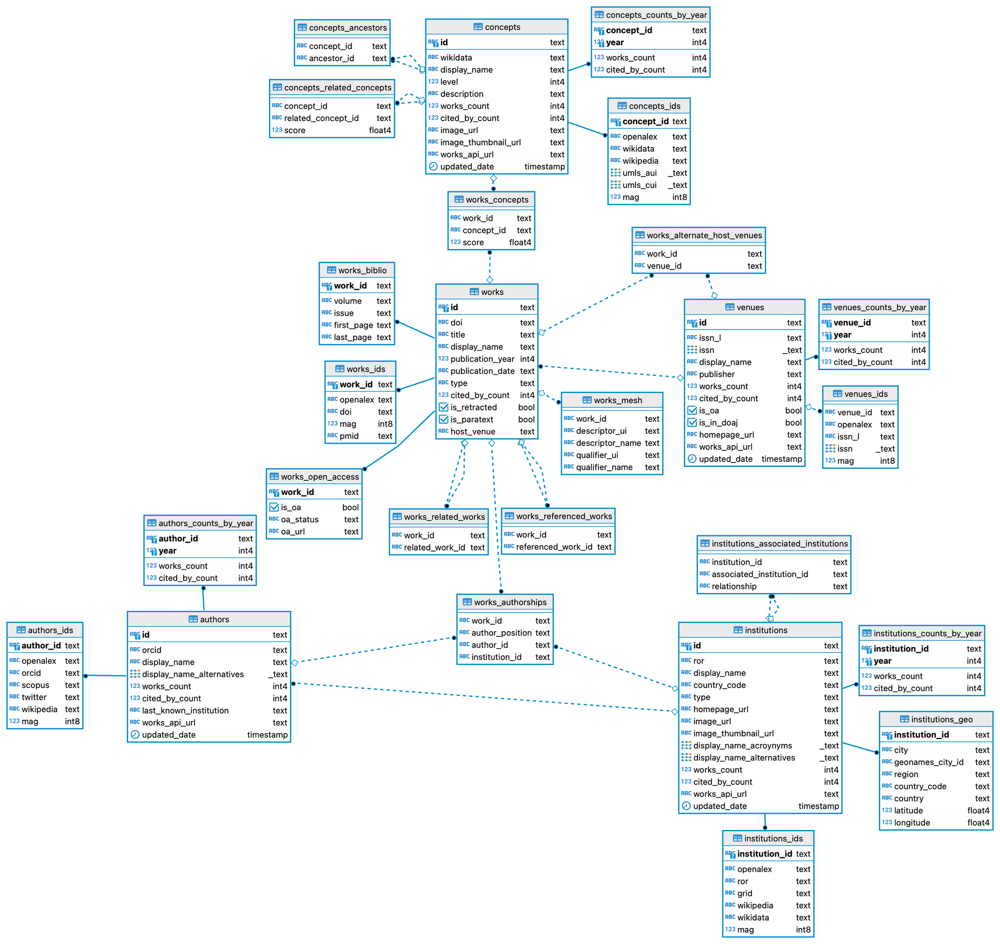

* 有关数据导入的部分（目前是手动导入）包括每个work(论文)对应的authors,concepts以及每个author对应的institutions部分，导入python程序为insert.py

### 文件存储
文件在Windows系统下被存储在 项目路径（自动识别）\store\..
文件在Linux系统下被存储在 /root/Scholar/store/..


### 后续


### ElasticSearch环境配置
下载群里指定的三小只后（这里的elasticsearch缺失文件，请下载我发的新文件),解压

在elasticsearch-8.15.3\bin目录下运行elasticsearch.bat可能会出现
```
warning: ignoring JAVA_HOME=?; using bundled JDK
```
如果enter后退出，这是因为es一般会检查环境变量中是否有jdk可用，而es一般会绑定一个对应的jdk版本，如果你的本地版本不同，就会出现上述问题
解决方法：
在elasticsearch-7.12.1-windows-x86_64\elasticsearch-7.12.1\bin路劲下打开elasticsearch-env.bat进行修改：
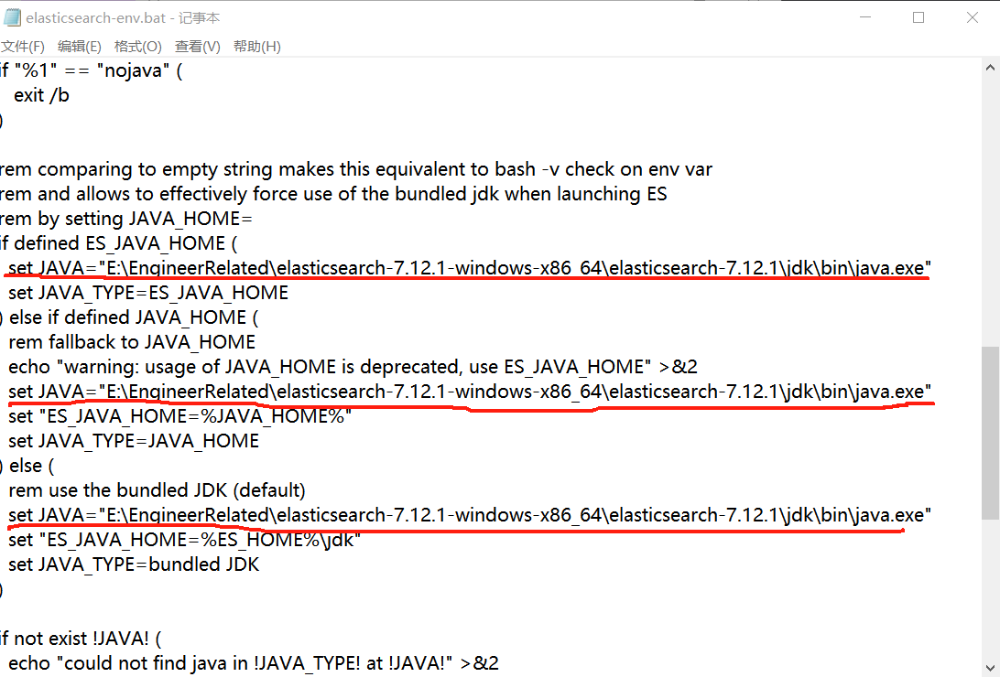
将这三个地方改成ES自带jdk就行，即elasticsearch-7.12.1-windows-x86_64\elasticsearch-7.12.1\jdk\bin路径下的java
保存退出重新运行elasticsearch.bat，在浏览器中打开http://localhost:9200/，出现以下信息即成功
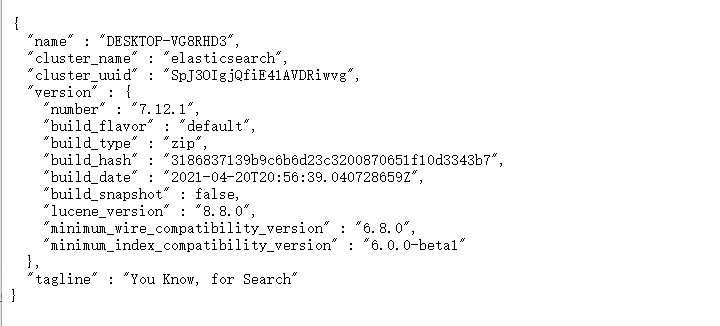
接下来在kibana-7.12.1-windows-x86_64\kibana-7.12.1-windows-x86_64\bin路径下运行kibana.bat
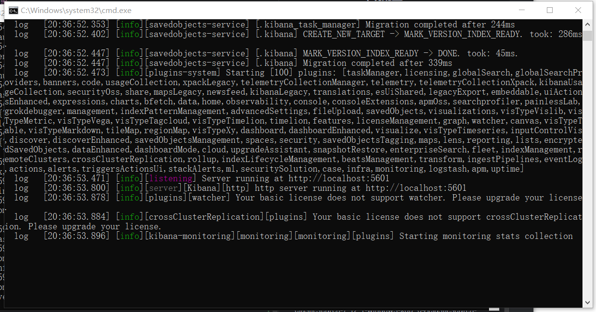
出现上图即成功，不成功的话，就在elasticsearch-env.bat运行界面多enter几下）
接下来在网页端打开http://localhost:5601/,这是kibana的管理界面，搜索index到index Management界面
下一步我们用logstash将数据库内容拉到es本地仓库中：
首先，将在群里发送的mysql-connector-java-8.0.28复制到logstash-7.12.1-windows-x86_64\logstash-7.12.1\bin路径底下
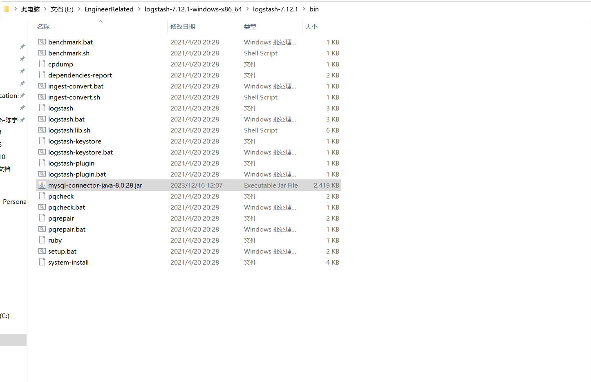
然后在logstash-7.12.1-windows-x86_64\logstash-7.12.1\config路径下，新建一个xxx.conf(自己取名)
在里面填上以下内容(注意将jdbc_driver_library项改成自己实际的地址):
```
input {
  jdbc {
    jdbc_driver_library => "E:\EngineerRelated\logstash-7.12.1-windows-x86_64\logstash-7.12.1\bin/mysql-connector-java-8.0.28.jar"
    jdbc_driver_class => "com.mysql.cj.jdbc.Driver"
    jdbc_connection_string => "jdbc:mysql://39.105.221.80:3306/scholar?useSSL=false&serverTimezone=Asia/Shanghai&allowPublicKeyRetrieval=true"
    jdbc_user => "scholar"
    jdbc_password => "scholar"
    jdbc_paging_enabled => "true" #是否进行分页
    jdbc_page_size => "50000"
    # statement_filepath => "sql文件路径，与下面的执行语句二选1"
    statement => "SELECT * FROM scholar.openalex_works"
    # 设置监听间隔  各字段含义（由左至右）秒、分、时、天、月、年，全部为*默认含义为每分钟都更新
    schedule => "* * * * * *"
  }
}
output {
  elasticsearch {
    document_id => "%{id}"
    index => "openalex_works_index"
    hosts => ["localhost:9200"]
  }
  stdout{
    codec => rubydebug
  }
}


```
保存后在控制台进入logstash-7.12.1-windows-x86_64\logstash-7.12.1\bin路径下，输入命令：
```
logstash -f ../config/xxx.conf
```
看到以下结果即为成功导入es索引库
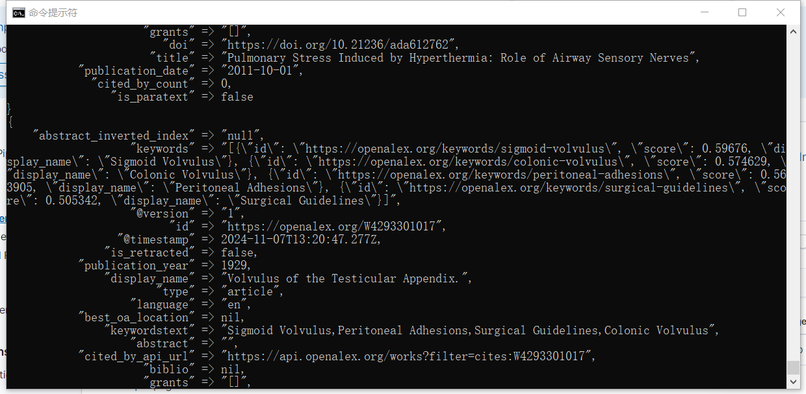
导入ing（等待一段时间后直接ctrl+c退出程序即可，这里设置为每分钟导入一次，所以不会停下来)
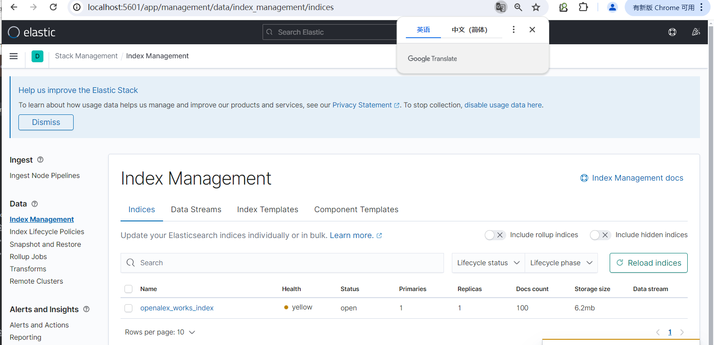
出现索引喽（好耶）

配置结束后需要记得maven重建一下，以导入es相关依赖


### 2024.11.10 
在启动类中加入了脚本的启动，在执行bat脚本后对本机的对应端口进行监听，确认es/kibana服务启动后再执行。
**注意：在ScholarApplication中我使用的是环境变量⚠️⚠️，大家注意要设置自己的环境变量。**
启用效果：
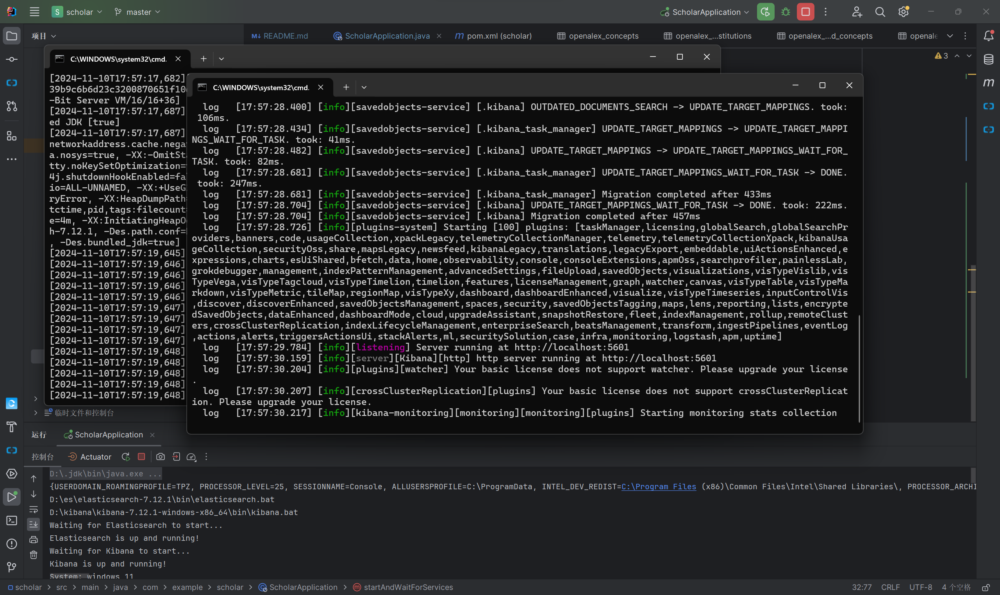
<br/>

配置方法：

<br/>

之后点击高级系统设置-> 环境变量，进入后点击“新建”。
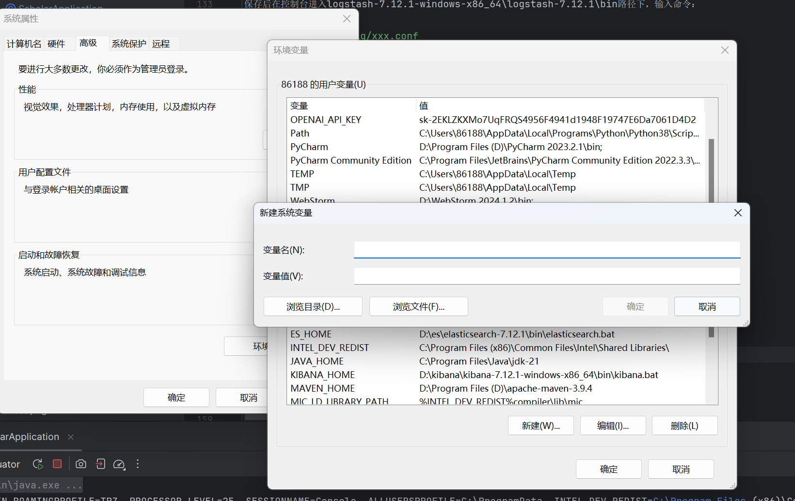
<br/>

这里我新建的是系统变量，但用户变量按理来说也可行）
分别新建ES_HOME和KIBANA_HOME，路径为对应执行文件(.bat)。
如果创建的是系统变量，需要重启电脑后才能运行。
运行项目，发现控制台能输出路径而没有报错，说明已经配置无误。
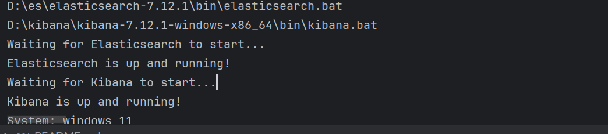
<br/>
考虑到可能会有点麻烦，程序会检测是否已配置环境变量。如果没配置可以控制台手动输入。
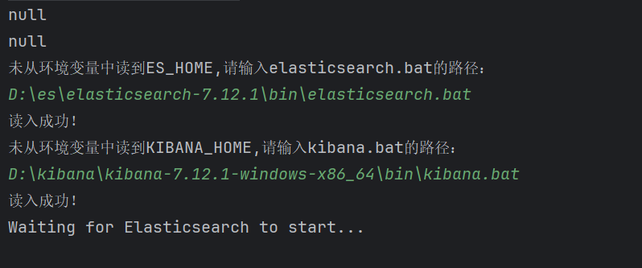
可能还有别的注意项，之后再添加，希望大家开发顺利~🤪


### 2024.11.14 最新更新-添加ik分词器插件
首先解压群发的文件ik.zip将文件挪到elasticsearch-7.12.1-windows-x86_64\elasticsearch-7.12.1\plugins目录底下
，然后依次运行elasticsearch.bat,kibana.bat，
进入http://localhost:5601 kibana控制主页,进入dev-tool调试工具界面
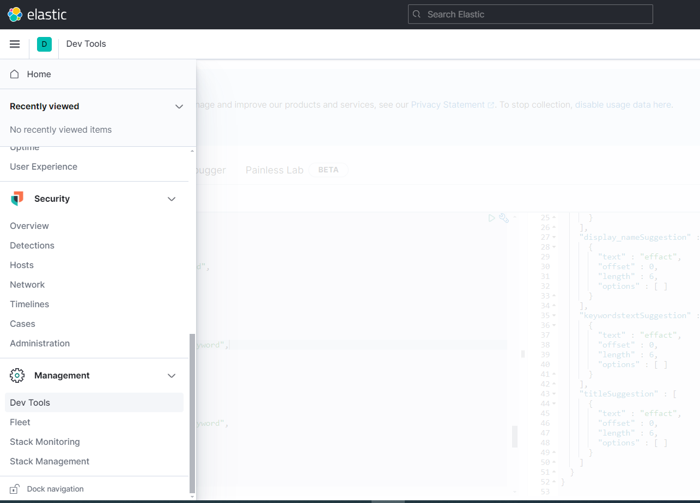
输入以下命令：
命令一：创建新的索引（其中为abstract、title、keywords等添加completion field，用于自动补充）
```
PUT /openalex_works_index_addingcompletion1
{
  "mappings": 
    {
      "properties" : {
        "@timestamp" : {
          "type" : "date"
        },
        "@version" : {
          "type" : "text",
          "fields" : {
            "keyword" : {
              "type" : "keyword",
              "ignore_above" : 256
            }
          }
        },
        "abstract" : {
          "type" : "text",
          "fields" : {
            "keyword" : {
              "type" : "keyword",
              "ignore_above" : 256
            },
            "suggest_field": {
              "type": "completion",
              "analyzer":"ik_smart"
            }
          }
        },
        "abstract_inverted_index" : {
          "type" : "text",
          "fields" : {
            "keyword" : {
              "type" : "keyword",
              "ignore_above" : 256
            }
          }
        },
        "best_oa_location" : {
          "type" : "text",
          "fields" : {
            "keyword" : {
              "type" : "keyword",
              "ignore_above" : 256
            }
          }
        },
        "cited_by_api_url" : {
          "type" : "text",
          "fields" : {
            "keyword" : {
              "type" : "keyword",
              "ignore_above" : 256
            }
          }
        },
        "cited_by_count" : {
          "type" : "long"
        },
        "display_name" : {
          "type" : "text",
          "fields" : {
            "keyword" : {
              "type" : "keyword",
              "ignore_above" : 256
            },
            "suggest_field": {
              "type": "completion",
               "analyzer":"ik_smart"
            }
          }
        },
        "doi" : {
          "type" : "text",
          "fields" : {
            "keyword" : {
              "type" : "keyword",
              "ignore_above" : 256
            }
          }
        },
        "grants" : {
          "type" : "text",
          "fields" : {
            "keyword" : {
              "type" : "keyword",
              "ignore_above" : 256
            }
          }
        },
        "id" : {
          "type" : "text",
          "fields" : {
            "keyword" : {
              "type" : "keyword",
              "ignore_above" : 256
            }
          }
        },
        "is_paratext" : {
          "type" : "boolean"
        },
        "is_retracted" : {
          "type" : "boolean"
        },
        "keywords" : {
          "type" : "text",
          "fields" : {
            "keyword" : {
              "type" : "keyword",
              "ignore_above" : 256
            }
          }
        },
        "keywordstext" : {
          "type" : "text",
          "fields" : {
            "keyword" : {
              "type" : "keyword",
              "ignore_above" : 256
            },
            "suggest_field": {
              "type": "completion",
               "analyzer":"ik_smart"
            }
          }
        },
        "language" : {
          "type" : "text",
          "fields" : {
            "keyword" : {
              "type" : "keyword",
              "ignore_above" : 256
            }
          }
        },
        "publication_date" : {
          "type" : "date"
        },
        "publication_year" : {
          "type" : "long"
        },
        "title" : {
          "type" : "text",
          "fields" : {
            "keyword" : {
              "type" : "keyword",
              "ignore_above" : 256
            },
            "suggest_field": {
              "type": "completion",
               "analyzer":"ik_smart"
            }
          }
        },
        "type" : {
          "type" : "text",
          "fields" : {
            "keyword" : {
              "type" : "keyword",
              "ignore_above" : 256
            }
          }
        }
      }
    }
}

```
运行命令（点击播放按键）； 

命令二：复制当前索引数据到目的索引
```
POST _reindex
{
  "source": {
    "index": "openalex_works_index"
  },
  "dest": {
    "index": "openalex_works_index_addingcompletion1"
  }
}
```

运行命令（点击播放按键）

end   0w0