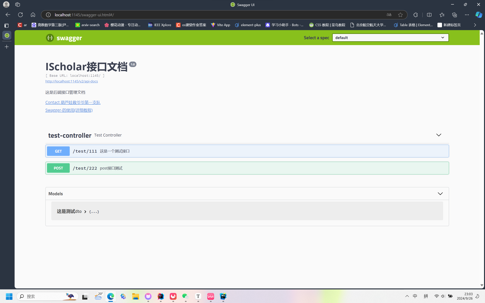
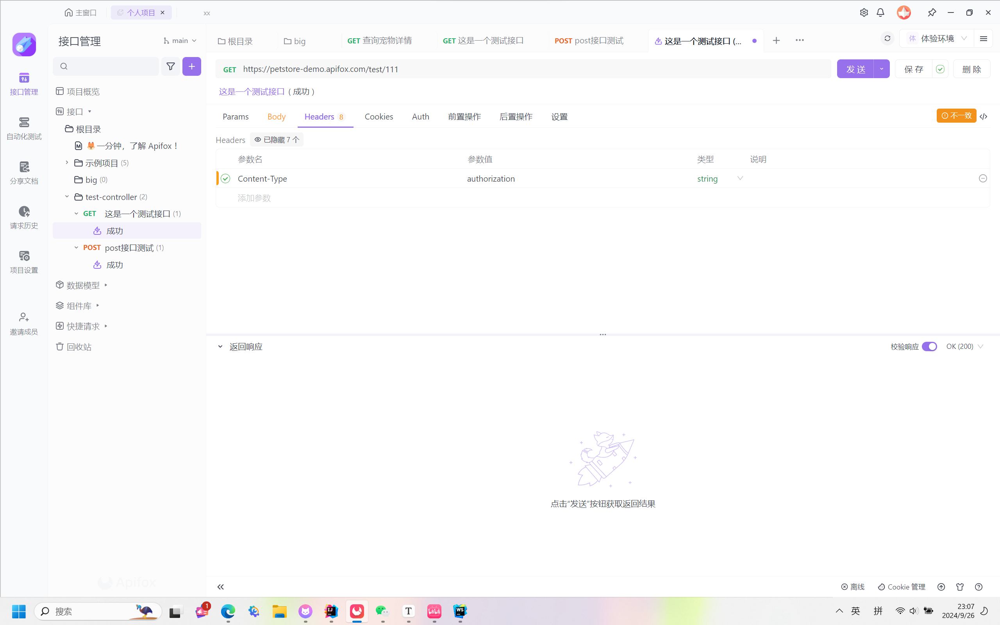
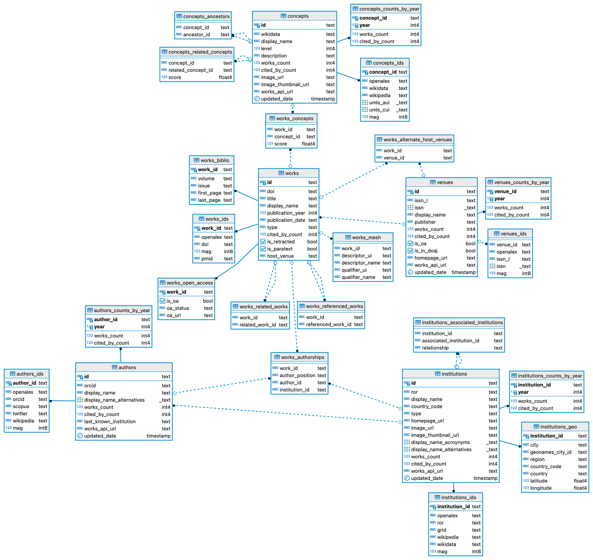

# 开发注意事项

😘为后续开发的顺利与规范，请teamies仔细阅读本文档后再进行开发.

* #### ⚠️请不要擅自删改（尤其是删）`pom.xml`的文件，如果有需要引入的新的依赖，请在群里与大家交流后再进行修改。

### 项目架构介绍

* 文件命名：软件包均为小写，Java类及接口采用大驼峰命名，即首字母大写。

* 本项目中，`MyBatis`和`MyBatisPlus`均已引入，但建议优先使用`MyBatis`。

* `config`文件夹下有两个配置文件，对应需要添加的`@Configuration`类可放在该包下。

* `dao`为数据访问层，也就是`mapper`层。该文件夹下Mapper接口的对应配置文件在`/resources/mapper/*.xml`中。
* `dto`
* `domain`为实体类，其中每个实体类需要加`@Data`注解，最好再加一个`@ApiModel`的注解（用于Swagger进行实体类管理，后面会说）

* `domain`中的R为返回类，R继承了`HashMap<String, Object>`，作为一个封装好的Json文件返回给前端。R类的基本使用方法：

  ```Java
  return R.ok();.//返回一个code为200的json
  return R.error();//返回code为414的json
  return R.ok("this is message");//返回code为200，msg为"this is message"的json
  return R.ok().put("data",users);//返回code为200，"data"为users的json
  return R.error().put("error",error);//返回code为414，“error"为error的json
  ```

  如有其他问题请联系tpzzz（嘻嘻🥵

* `service`文件夹下包含接口以及`impl`包（对应的具体实现类）

* `util`文件夹下放所有会用到的工具类。

### 开发环境说明

* 在`resource`文件夹下有多个`yaml`文件，其中`application.yaml`为全局配置，`application-dev.yaml`  `application-pro.yaml`为对应的开发环境。在`application.yaml`中有这样的代码：

  ```yaml
  spring:
    application:
      name: scholar
    profiles:
      active: dev # 在这里切换项目环境，dev为开发环境（本地数据库），pro为生产环境（已连接服务器数据库）
  
  ```

* ###### ⚠️`Swagger2`说明：

  Swagger的具体使用可以参考这篇博客：[Swagger的使用教程](https://blog.csdn.net/xhmico/article/details/125353535)

  在开发过程中最好按照规范添加注解，以便于前后端的功能查看。包括`@ApiModel` `@ApiOperation`等注解。启动后端程序后，可通过`http://localhost:1145/swagger-ui.html#/`进入到Swagger的可视化界面。在这里可以看到所有接口及Model的定义，也可以进行接口测试。swagger的UI如下图：

  

* `Apifox`集成`Swagger2`

  `ApiFox`有对于Swagger2的一键集成。集成后在Apifox可以直接进行单元测试。参考博客：[ApiFox一键导入Swagger](https://blog.csdn.net/gdjnrc_com/article/details/125560570#:~:text=Apifox%E5%A6%82%E4%BD%95%E4%B8%80%E9%94%AE)

  导入后效果如图：

  

### 论文部分数据结构介绍


* 有关数据导入的部分（目前是手动导入）包括每个work(论文)对应的authors,concepts以及每个author对应的institutions部分，导入python程序为insert.py


### 后续


可能还有别的注意项，之后再添加，希望大家开发顺利~🤪
